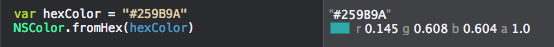

# NSColor+hex

Easily create NSColor objects from hex colors in Swift



## sample usage
```swift
var hexColor = "#259B9A"
NSColor.hex(hexColor)
// returns an NSColor object:
// `NSColor(calibratedRed: 0.145, green: 0.608, blue: 0.604, alpha: 1)`
````